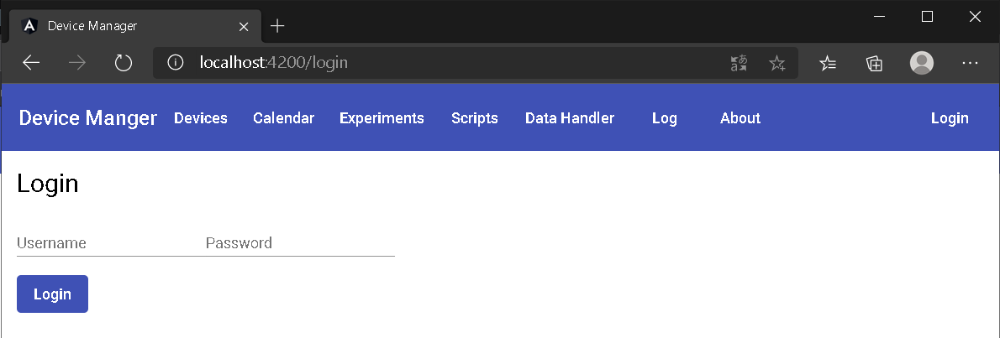
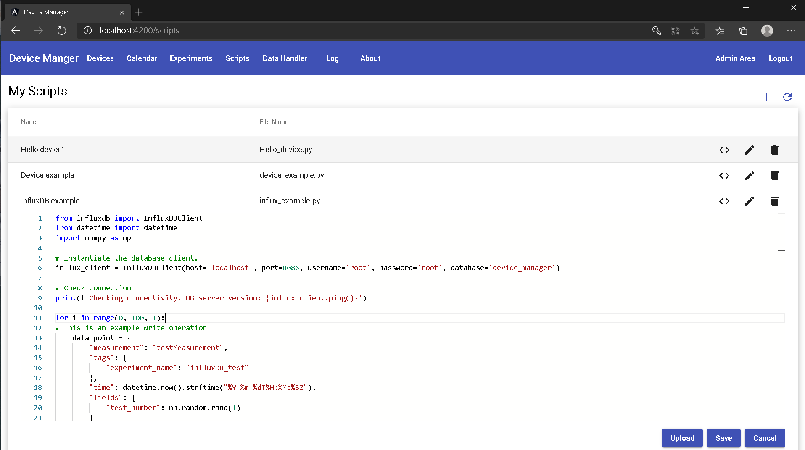

How-To
=======

Connecting to the device manager
---------------------------------

If your device manager server is running on your local machine or on a computer within your network, you can
connect to the frontend from any internet capable device with a modern browser. Simply connect using one of the
following URLs:

If the server is running locally:

    `localhost:4200 <http://localhost:4200>`_ or `127.0.0.1:4200 <http://127.0.0.1:4200>`_

If the server is running on another computer within your network:

    <host-server-ip\>:4200

Login page
-----------

The log-in view is a security feature, that ensures that only registered users have access to the devices in your
network. The Open Authorization protocol 2 (OAuth2) is used to secure communication between the backend and frontend.
Once logged-in, you can add new users, delete users and reset passwords. The device manager frontend uses the Angular
Authentication tool (AuthInterceptor) which relies on a HttpInterceptor interface to grant access to permitted users.
If accessed from the host machine, the url of the login-page is `<localhost:4200/login>`_. The default username is
**admin** and the default password is **1234**. It is strongly recommended to change the default password of the admin
account.

Main page - Devices
---------------------
The devices page is the device managers main view. Registered devices are listed here and some useful detail is provided
on first sight. This includes the devices server name, address, port. Furthermore, the connection status is indicated. In a future version other devices types than SiLA, such as offline devices, custom device or OPC-UA types shall be supported.
Several buttons allow the user to expand the visible detail of the device, change its current name, or
remove the device from the manager.

Clicking on the device name or the information icon expands the view of the selected
device, showing the implemented features and the respective descriptions. Each feature can be expanded even further to
investigate which (observable) commands and (observable) properties are implemented by the feature. Exploring individual
commands and properties shows the user useful information on functionality and usage. Required parameters and responses
are displayed with the attributed SiLA-datatype.

.. image:: _static/figures/devices.png
    :width: 800
    :alt: A view of the main page, the devices list, including general device details

Device discovery
^^^^^^^^^^^^^^^^^^
The device manager uses the SiLA2 auto-discovery functionality which relies on multicast DNS service discovery
(`zeroconf <https://pypi.org/project/zeroconf/>`_) to register its services in
the network. New devices can be added by clicking the "plus"-button on the top right of the device table. Device
discovery is started from within a new pop-up window. The discovery mode scans for SiLA devices in the network and displays the
basic information it was registered with by the server. This information is used to connect to the server using a
dynamic client. The client files are stored in the local temporary folder named after the devices server-UUID:
Relative path to the directory: *[...]temp/device-manager/SiLA/<device-UUID>/*

.. image:: images/discovery.png
    :width: 800
    :alt: A view of the discovery feature for adding new devices to the manager

SiLA Explorer - The device tree
^^^^^^^^^^^^^^^^^^^^^^^^^^^^^^^^
Each device that is added to the device manager is assigned an internal UUID. This way devices with the same server
name can be uniquely identified. The device tree enables the user to run commands and request properties interactively
from within the browser. On the lowest level of the device tree, the command/property level, a run button can be clicked
to execute the function. For functions that require user input, the parameters can be entered in the corresponding text
box. The syntax by which the call can be incorporated into python scripts in the scripting environment is shown.

.. image:: images/device-tree.png
    :width: 800
    :alt: A view of the discovery feature for adding new devices to the manager

The data handler
------------------
`InfluxDB <https://portal.influxdata.com/downloads/>`_ databases can be registered and linked to devices. InfluxDB is a time-series
database that is well suited for experimental data. To be able to use this feature, an InfluxDB server must be running
within your network. Providing the connection details to the device manager is sufficient. A username and password can
be added optionally for additional security. A registered database can be linked to a device to setup automatic data
transfer. Data transfer is started as soon as the booking of a device commences, i.e. the experiment the device is
used in is started. The database-device link can be deleted by selecting the empty database in the dropdown menu.

The data handler will execute the configured calls in the user-specified polling intervals and
store the responses in the linked database with experiment name, device name, and user name as tags. To activate the data
acquisition for a selected device, the "active"-checkbox must be ticked. If responses of certain functions, or features
all together, should not be stored, further checkboxes can be found on the lower levels of the device tree to deactivate
data transfer. This is crucial to disable the execution of set commands for example.

Most types of data can be classified as either meta-data or measurement data. Typically, meta-data doesn't need to be
queried on a continuous basis. In most cases, requesting meta data (device ID, calibration data, etc. etc.) once at the
beginning of an experiment is sufficient. Measurement data (Temperature, pressure, etc. etc.) on the contrary is usually
queried on a more frequent basis. The data handler distinguishes between the two data types. Since there is no way to
distinguish the type of data queried by a call automatically in a reliable fashion, the user can specify the type for
each command using the meta-checkbox. Depending on the selection, a default value is implemented
(1h for meta-data, 60s for measurement data). Obviously, different users have different needs regarding polling
intervals, thus the defaults can be overwritten to transfer data according to a custom polling interval.

.. image:: images/data-handler.png
    :width: 800
    :alt: A view of the data handler feature

Only one configuration can be stored at a time. Future releases will include the possibility to upload and download
configuration files and select configuration files for a specific booking. The data handler simplifies data-acquisition
and encourages collection of all data and meta-data for improved data integrity. The separation of the data acquisition
from the user script used in the experiment has several advantages:

    1. The query calls are not part of the user-script, improving readability and making the script shorter.
    2. Reduces the amount of code that needs to be written by the operator.
    3. Data-acquisition is out-sourced to a separate process. This way data-acquisition is guaranteed to continue in case an experiment crashes.
    4. The data can be easily accessed from within the user script. An example script is provided in the scripts-section of the application.

.. image:: images/data-handler-tree.png
    :width: 800
    :alt: A view of the data handler feature

Scripting environment - Scripts
--------------------------------

This page allows the user to upload, create and edit scripts. The main view shows a list of all saved scripts.
Clicking on the script name or the **<>**-icon opens the script editor. The code editor is based on the
`Monaco Editor <https://www.npmjs.com/package/ngx-monaco-editor>`_ and includes syntax highlighting. Auto-completion is
not supported. Registered scripts can be assigned to experiments in the experiment section. A script assigned to an
experiment is executed in a docker container. The docker image is created based on the provided dockerfile which is
stored in the folder *user_script_env*. If non-standard python packages are required for the script execution, they must
be specified in the *requirements.txt*.

.. warning::
    Scripts are not checked for programming errors. Check your code in an IDE before scheduling any experiments!

Hello world!
^^^^^^^^^^^^

The *Hello device!* example is one of three pre-installed example scripts. You can find this example among the others
in the \'Scripts\'-tab. Assign this script to a new experiment and schedule it for execution. The output should be
printed to the experiment console view.

.. code-block:: python

        # You can use this code editor like a regular scripting environment.
        # If you require specific python packages for your script, you can import them here.
        # Note: Packages you want to import must be specified in the dockerfiles requirements.txt!

        print("Hello World!")

Device integration
^^^^^^^^^^^^^^^^^^^^
All registered devices can be accessed in the scripting environment. However, used devices should be selected in the
experiment setup phase. A dictionary with all device clients can be imported. Instantiating the client enables the user
to execute all functions the device offers. Further information on the python syntax for the device object access can be
found in the *'Device example'* in the scripting environment. It is recommended to select all used devices during the
experiment setup phase to avoid multi-access and interference with other experiments. Selecting a device will reserve
the device for exclusive use for that script.

.. code-block:: python

        This is example python code that will show how the device clients can be imported, instantiated, and used.
        The exact implementation is still WIP

Database integration
^^^^^^^^^^^^^^^^^^^^

This example shows you how to include read and write operations to and from databases into your script. The client
package of the database must be included in the docker requirements.txt, so you can access the client object in the
scripting environment.  Specify the database connection details when instantiating the client object.

As a first step, we ping the database to check whether we can establish a connection. The ping operation should return
the version number of the used database. Afterwards, a datapoint is written to the database and queried subsequently.
This is repeated a hundred times with an in-built delay time of 10 seconds. Check the experiment output console and the
chronograf interface.

.. code-block:: python

        from influxdb import InfluxDBClient
        from datetime import datetime
        import numpy as np

        # Instantiate the database client.
        influx_client = InfluxDBClient(host='localhost', port=8086, username='root',
                                       password='root', database='device_manager')

        # Check connection
        print(f'Checking connectivity. DB server version: {influx_client.ping()}')

        for i in range(0, 100, 1):
        # This is an example write operation
            data_point = {
                "measurement": "testMeasurement",
                "tags": {
                    "experiment_name": "influxDB_test"
                },
                "time": datetime.now().strftime("%Y-%m-%dT%H:%M:%SZ"),
                "fields": {
                    "test_number": np.random.rand(1)
                }
            }
             try:
                influx_client.write_point([data_point])
            except:
                 print("This did not work...")

            # This is an example query.
            results = influx_client.query(
                'SELECT test_number FROM "device_manager"."autogen"."testMeasurement" WHERE'
                'experiment_name = \'influxDB_test\' GROUP BY position ORDER BY DESC LIMIT 1')
            print(results)

            time.sleep(10)

[WIP] Process monitoring
^^^^^^^^^^^^^^^^^^^^^^^^^^
Scripts are executed in a docker container. Interaction with a running docker container is limited. The *stdout* of the
docker container is transferred to the frontend by websockets. For real-time visualization of process data we recommend
using `chronograf <https://www.influxdata.com/time-series-platform/chronograf/>`_. Chronograf offers a complete interface
for the influxDB database. All data collected by the data handler can be visualized using the chronograf IoT frontend.

Experiments
-----------------
Automated experiments (or processes) require access to devices via a well-specified interface, a script that
orchestrates device operation and a database to store relevant information. The experiments view enables the user to
setup such workflows and schedule their execution. On the experiments page new experiments can be created by pressing
the the 'plus'-symbol. The experiment execution time, the script to be executed, as well as the devices required for
execution can be defined in a pop-up form. Creation of experiments that require the booking of devices unavailable
during the desired time-frame is not possible. If two experiments must access the same device simultaneously, a booking
should be avoided. The device is still accessible to the script.

.. warning::
    This is a safety measure to avoid potentially detrimental consequences caused by multiple access to state-sensitive devices.

The main view of the experiments tab shows a list of scheduled experiments, accompanied by the most important
information such as the start and end time of the experiment, booked devices, the user script and the current status of
the experiment. Scheduled experiments automatically create a booking entry in the calendar view.
The experiment status may be one of the following:

+------------+-------------------------------------------+
| Status     |                  Meaning                  |
+============+===========================================+
| unknown    | The experiment has not been started yet   |
+------------+-------------------------------------------+
| finished   | Docker container finished with exit code 0|
+------------+-------------------------------------------+
| running    | Docker container is still running. The    |
|            | scheduled end time has not yet elapsed    |
+------------+-------------------------------------------+
| error      | Docker container finished with exit code 1|
+------------+-------------------------------------------+

It is possible to start experiments before their scheduled starting time by pressing the 'play'-icon. A running
experiment can be aborted prematurely by pressing the 'stop'-button.

.. image:: _static/figures/experiments.png
    :width: 800
    :alt: A view of the experiment view

.. note::
    In development mode the scheduler.py script must be running for experiments to be executed.

Device calendar
------------------
If a device is assigned to a specific experiment, a booking is automatically created for the entire timeframe of the experiment.
A device can only be assigned to an experiment if it is available throughout the experiments start and end time. The
calendar page visualizes these bookings and provides the user with additional information on the booking, such as the respective
experiment, script and the user who created it. Furthermore, it is possible to create bookings manually. This allows the
reservation of devices. In a future release, non-SiLA devices and "offline"-devices will be available as well. The
calendar could be used as a laboratory-wide booking system for other legacy devices such as autoclaves or other resources.

It is possible to delete bookings manually. Even automatically created bookings can be deleted. However, this would
circumvent the in-built security mechanism and may lead to devices being accessed by multiple experimental scripts at
the same time.

.. image:: _static/figures/calendar.png
    :width: 800
    :alt: A view of device bookings. The calendar.

